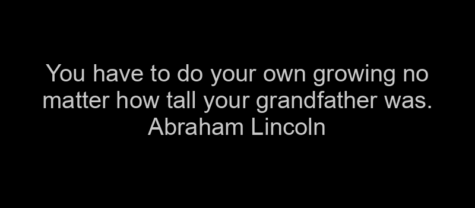

# Mastodon Quote Bot

Inspired by this [auth0](https://auth0.com/blog/how-to-make-a-twitter-bot-in-python-using-tweepy/) post but modified for the Mastodon Fediverse. Hopefully, in the future, I can add more features like the Twitter equivalent. 

## What's it do?

Pretty simple: the bot toots a random famous quote hourly from [quotable.io](https://api.quotable.io/random) to the Fediverse through Mastodon instance [botsin.space](https://botsin.space/).

## What's it need?

- Python3
- pip3
- json
- requests
- logging
- Pillow
- Mastodon.py

## How do I make it work?

- Create a [bot account](https://shkspr.mobi/blog/2018/08/easy-guide-to-building-mastodon-bots/) on a Mastodon instance ([botsin.space](https://botsin.space) is a good option)
- Place your application access token in *token.secret*
- ???
- Profit!

## What if that doesn't work?

"It works for me!" Sorry. Poke around and see what you may have missed. I tested it, it works.

## Where'd that font come from?

Arial Font from [JotJunior](https://github.com/JotJunior/PHP-Boleto-ZF2/blob/master/public/assets/fonts/arial.ttf) is the default font used. However, you can provide any font you'd like to use (use the full path or place it in the same directory as the bot).

